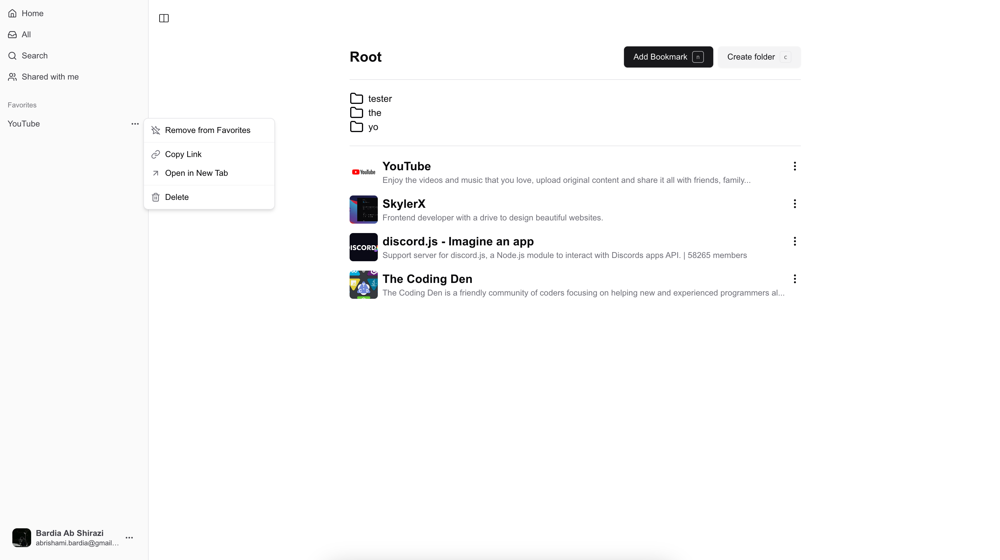

# Bkmrks

A modern web application for saving bookmarks. Built with Next.js, featuring secure authentication and sharing capabilities.



## Architecture

This project uses a monorepo structure to support scalability and future extensions:

```
├── apps/
│   ├── web/          # Next.js web application
│   └── extension/    # Chrome extension (planned)
├── packages/         # Shared utilities and ui components etc
```

### Technical Decisions

- **Monorepo Structure**: Chosen to support modularity and code sharing between web and planned extension
- **Next.js**: Leverages server-side rendering and API routes for optimal performance
- **Auth.js**: Secure authentication with flexibility for multiple providers
- **DrizzleORM**: A powerful and modern ORM for TypeScript
- **Resend**: Email verification
- **ShadCN UI**: A modern and customizable UI library
- **Tailwind CSS**: A utility-first CSS framework
- **Zustand**: A state management library for React

### Git flow

This project was built using a git flow structure. This means we create an optimal flow of where data gets pushed and stored to until the final moment in which we are ready to commit to the main branch (the production branch). This will ensure that the data is always up-to-date and ready to be used.

If you want to use git flow you can either set it up manually or use the [git flow cli](https://skoch.github.io/Git-Workflow/)

### Core Features

- Secure authentication flow
- Data sharing with granular permissions
- Made for self-hosting / local usage.
- Clean and fast interface.
- Shortcuts and options for quick access.

### Future Roadmap

- Chrome extension integration for seamless browsing experience
  - Extension architecture and manifest prepared
  - Authentication flow designed
  - Planned for Phase 2 development

## Development

### Docker (optional)

If you don't have docker installed you can visit [docker.com](https://www.docker.com/) to download and view the installation instructions.

If you decide to use docker, you can run the following commands to start the development environment:

```bash
# in the root directory of the project
pnpm docker:dev
```
This will start the development environment and mount the project directory inside the container.

To view logs:
```bash
pnpm docker:logs
```

Other useful commands:
```bash
pnpm docker:build # build the docker image
pnpm docker:reset # reset the development docker environment (data will be lost if not saved)
pnpm docker:down # shutdown the development docker environment
```

### Local Setup


You can install the packages using `pnpm` or any other package manager of your choice.

```bash
# in the root directory of the project
pnpm install
```

you can run `pnpm dev` in the `root` directory to start the development server. Turbo will automatically handle the running of the different packages and local caching.

If you want to use the database commands you can navigate to `apps/www` and run `pnpm db:<command>` to interact with the database.

---

To install packages you can use `pnpm` either in the root directory or in the `apps/www` directory.

If you use the root directory (and pnpm) you have to add `-w www` to the end of the command to ensure that the packages are installed in the correct directory.

---

## Security

- Secure session management
- Rate limiting on critical endpoints

## Lessons Learned

- Importance of proper permission modeling for shared resources
- Benefits of modular architecture for future scalability
- Challenges in cross-platform authentication design

## Note

This project is not a real software that is being promoted for use. However, if you like to use it for your link sharing or storage needs, feel free to use it. However, due to the nature of the project, a hosted version is not available at this time.

I primarily built this project not only for my own use case but also to get my hands dirty after being away from Github for a while. My main goal was to show my knowledge of the technologies and also expand my skillset. This project is not meant to be used in production, but rather as a learning experience.

However, this doesn't define all future developments. The current app I am building (not this one) <strong>is</strong> meant to be used in production for real world value. The project will also be open sourced.

## Contributing

This project was created as a portfolio piece demonstrating architectural decision-making and implementation skills. However, feel free to contribute to the project if you have any ideas or suggestions. It would be highly appreciated if you could work on active issues or help me move the project further along.